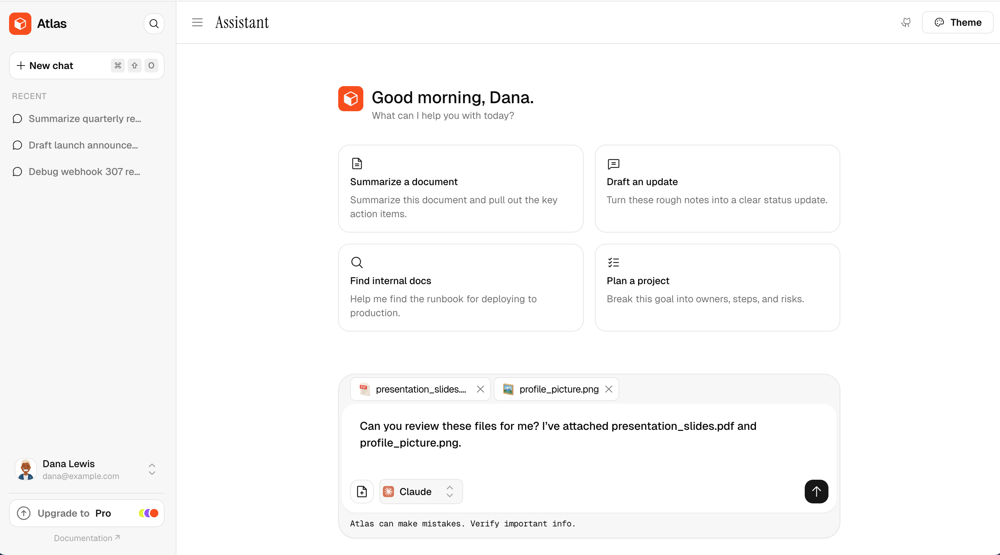

# AI Assistant Template

A polished, accessible AI assistant interface — built entirely with **[@dlbcodes/my-design-system](https://my-design-system-beta.vercel.app/)**.

It's a real-world showcase of the library: chat, a command palette, settings, keyboard shortcuts, and a themeable sidebar, all composed from the same set of components.

**[Live demo →](https://dlbcodes-assistant.vercel.app/)**



---

## What it shows

A single, cohesive app that exercises the library across a lot of surfaces:

- **Chat** — message bubbles, streaming, attachments, and an empty state with suggestions
- **Command palette** — ⌘K to search and run actions, fully keyboard-navigable
- **Settings** — profile, preferences, security, and billing with usage meters (Progress)
- **Sidebar** — conversation history with rename and delete, plus a user menu
- **Keyboard shortcuts** — wired with the Kbd components and a shortcuts dialog
- **Auth pages** — sign-in and sign-up built from Field, Input, and Button
- **Theming** — restyle the entire app by editing design tokens, no component changes

Everything here is built with [@dlbcodes/my-design-system](https://my-design-system-beta.vercel.app/) — so it's a good place to see how the components compose into something real.

## Theming

The whole app is styled with semantic design tokens. Override the tokens and every component restyles at once — no component edits, no specificity fights.

See it live in the [theming playground](https://dlbcodes-playground.vercel.app/), or read the [docs](https://my-design-system-beta.vercel.app/).

## Tech

Vite · Vue 3 · TypeScript · Tailwind v4 · [@dlbcodes/my-design-system](https://my-design-system-beta.vercel.app/)

## Running it locally

```bash
git clone https://github.com/dlbcodes/dlbcodes-assistant.git
cd dlbcodes-assistant
npm install
npm run dev
```

No config, no API keys — it runs on mock data so you can explore the UI right away.

## License

MIT — use it however you like.

---

Built by [Daniel](https://x.com/dlbcode) with [@dlbcodes/my-design-system](https://my-design-system-beta.vercel.app/).
